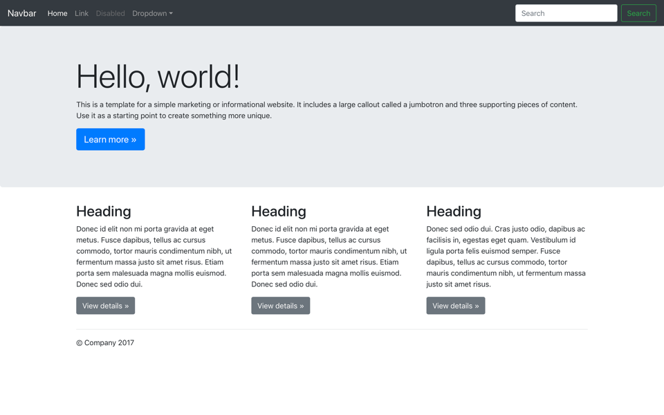
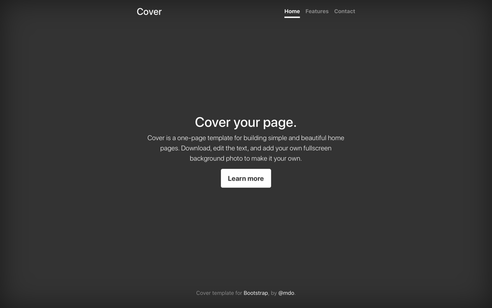
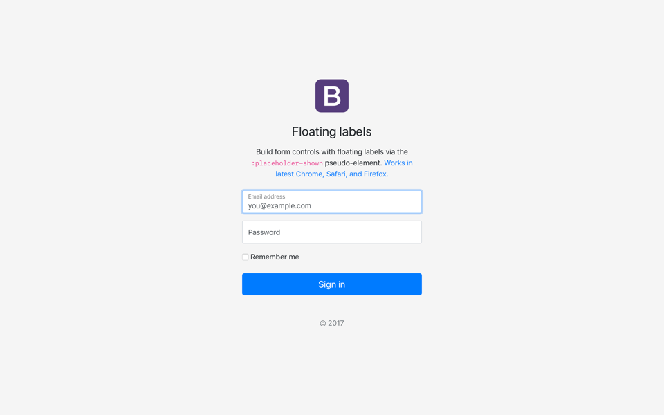
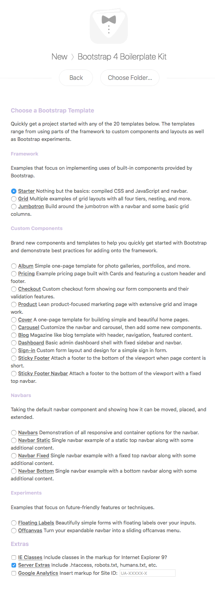
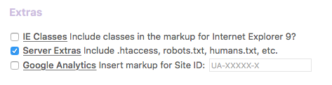
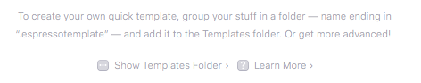
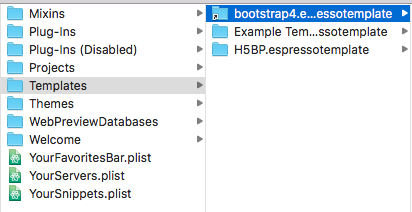
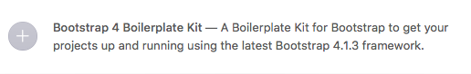

# Bootstrap 4 Boilerplate Kit for Espresso

A Boilerplate Template Kit for [Espresso][espressoapp] that speeds up your
project development by providing templates, code, CSS and scripts using the
[Bootstrap 4.1.3][bootstrap] framework.

###### Table of Contents

- [What is Included](#what-is-included)
  - [Bootstrap 4.1.3](#bootstrap-413)
  - [Vendor Scripts](#vendor-scripts)
  - [Theme Templates](#theme-templates)
    - [Framework](#framework)
    - [Custom Components](#custom-components)
    - [Navbars](#navbars)
    - [Experiments](#experiments)
  - [Theme Options](#theme-options)
  - [Extras](#extras)
  - [Favicons](#favicons)
- [Getting Started](#getting-started)
  - [Prerequisites](#prerequisites)
  - [Installing](#installing)
    - [In Espresso](#in-espresso)
    - [Via Terminal](#via-terminal)
- [Contributing](#contributing)
- [Code of Conduct](#code-of-conduct)
- [Versioning](#versioning)
- [Change-Log](#change-log)
- [Authors](#authors)
- [License](#license)
- [Acknowledgements](#acknowledgements)

## What is Included

This Boilerplate Kit's primary objective is to accelerate your development
process by providing you with all the files and code needed for working with the
most current release of [Bootstrap][bootstrap] - currently version 4.1.3. Not
only does this Kit include all the Bootstrap CSS and JS, `jQuery`, `Popper.js`
and `Holder.js` scripts, but it also includes 20 fully-functional example
templates that you can fire up and begin using as a base for your project.

Here is what is included in this Boilerplate Kit for `Espresso`.

### Bootstrap 4.1.3

You get the latest, minified CSS and JavaScript files for Bootstrap 4.1.3.
These are:

- bootstrap.min.css
- bootstrap.min.css.map
- bootstrap.min.js

### Vendor Scripts

The following vendor scripts are included in the template.

1. [Bootstrap 4.1.3][bootstrap]
1. [jQuery Slim 3.3.1][jquery]
1. [Popper 3.6.0][popper]
1. [Holder.js 2.9.4+cabil][holder]

### Theme Templates

The Bootstrap 4 Boilerplate Kit template for Espresso includes the following 20
template variations ranging from using parts of the framework to custom
components and layouts as well as Bootstrap experiments.

Here is an overview (with screenshots) of each of the included templates in the
Boilerplate Kit.

#### Framework

| Screenshot                                        | Template                                                                             | Screenshot                         | Template                                                                            |
|:--------------------------------------------------|:-------------------------------------------------------------------------------------|:-----------------------------------|:------------------------------------------------------------------------------------|
|  | **Starter:** Nothing but the basics: compiled CSS and JavaScript and navbar.         |  | **Grid:** Multiple examples of grid layouts with all four tiers, nesting, and more. |
|       | **Jumbotron:** Build around the jumbotron with a navbar and some basic grid columns. |                                    |                                                                                     |

#### Custom Components

| Screenshot                                                         | Template                                                                                         | Screenshot                                           | Template                                                                                     |
|:-------------------------------------------------------------------|:-------------------------------------------------------------------------------------------------|:-----------------------------------------------------|:---------------------------------------------------------------------------------------------|
|                                | **Album:** Simple one-page template for photo galleries, portfolios, and more.                   |              | **Pricing:** Example pricing page built with Cards and featuring a custom header and footer. |
|                          | **Checkout:** Custom checkout form showing our form components and their validation features.    |              | **Product:** Lean product-focused marketing page with extensive grid and image work.         |
|                                | **Cover:** A one-page template for building simple and beautiful home pages.                     |            | **Carousel:** Customize the navbar and carousel, then add some new components.               |
|                                  | **Blog:** Magazine like blog template with header, navigation, featured content.                 |          | **Dashboard:** Basic admin dashboard shell with fixed sidebar and navbar.                    |
|                            | **Sign-in:** Custom form layout and design for a simple sign in form.                            |  | **Sticky Footer:** Attach a footer to the bottom of the viewport when page content is short. |
|  | **Sticky Footer Navbar:** Attach a footer to the bottom of the viewport with a fixed top navbar. |                                                      |                                                                                              |

#### Navbars

| Screenshot                                         | Template                                                                                            | Screenshot                                           | Template                                                                                            |
|:---------------------------------------------------|:----------------------------------------------------------------------------------------------------|:-----------------------------------------------------|:----------------------------------------------------------------------------------------------------|
|            | **Navbars:** Demonstration of all responsive and container options for the navbar.                  |  | **Navbar Static:** Single navbar example of a static top navbar along with some additional content. |
|  | **Navbar Fixed:** Single navbar example with a fixed top navbar along with some additional content. |  | **Navbar Bottom:** Single navbar example with a bottom navbar along with some additional content.   |

#### Experiments

| Screenshot                                               | Template                                                                             | Screenshot                                   | Template                                                                  |
|:---------------------------------------------------------|:-------------------------------------------------------------------------------------|:---------------------------------------------|:--------------------------------------------------------------------------|
|  | **Floating Labels:** Beautifully simple forms with floating labels over your inputs. |  | **Offcanvas:** Turn your expandable navbar into a sliding offcanvas menu. |

### Theme Options

The following screenshot outlines the various options available to you when you
create a _New Project_ within `Espresso`.



### Extras

There is an optional Extras section which allows you to include extra
configuration files that form part of most modern-day web projects.

In the `Theme Options` you will find the following settings for you to choose
from:



These extras are:

1. **IE Classes:** this includes markup in your HTML document for IE9 that will
   display a browser upgrade message. When selecting this option a new
   `browser-upgrade.css` file is included in your `/css/` folder and is linked
   in your HTML markup. If you don't select this option then no additional
   markup or CSS is added to your HTML template.
1. **Server Extras:** includes an `.htaccess`, `robots.txt` and `humans.txt`
   file in the root of your project folder. You can edit these files and
   customise them to your needs. This option is selected by default as these
   files are recommended but if you don't select them then none of these files
   are added to your project.
1. **Google Analytics:** by including this, additional Google Analytics code is
   included in your markup just before the closing `</body>` tag. You have the
   option of inputting your Site ID at time of creating your template or, if you
   only create the GA tag later on, you can add the Site ID to the markup later
   on. If this option is unticked, no additional code is added to your markup.
1. **Font Awesome:** includes the CSS and webfonts required for using the
   [Font Awesome][fontawesome] library in your projects. To use Font Awesome
   just add markup to your html like this `<i class="fa fa-star"></i>` and you
   will get a star icon loaded in your document. If you don't select this option
   then the CSS and `/webfonts/` directory are not copied over into your
   project.

### Favicons

Each Bootstrap template that is generated from the Boilerplate Kit contains a
series of favicons that you can customise and use in your projects.

In the HTML markup for each template you will see these meta-tags:

```html
<link rel="icon" href="favicon.ico">
<link rel="manifest" href="manifest.json"> <!-- For Android Devices -->
<meta name="msapplication-config" content="browserconfig.xml"> <!-- For Windows and Microsoft Mobile -->
<link rel="apple-touch-icon" href="img/favicons/apple-touch-icon.png"> <!-- For Apple iOS -->
<link rel="mask-icon" href="img/favicons/safari-pinned-tab.svg" color="#563d7c"> <!-- For Safari -->
```

The following breaks down what each of the meta-tags provide.

- `favicon.ico` is the first meta-tag and sits in the root of your project
  folder. The `favicon.ico` is a compiled icon image made of 16x16, 32x32 and,
  in some cases, 64x64 pixel images. If you don't know how to generate a
  `favicon.ico` have a [look at this resource][favicon].
- `manifest.json` is used by Android devices and sits in your root folder. This
  json file contains the path to the various Android-specific favicon files.
  These files are locate in `/img/favicons/` and are labelled
  `android-chrome-192x192.png` and `android-chrome-512x512.png`. These are the
  default sizes required for most Android devices.
- `browserconfig.xml` is similar to the Android `manifest.json` but this file is
  specific to Windows and Microsoft devices. The `browserconfig.xml` contains
  links to Microsoft-specific favicon files. These files are located in
  `/img/favicons/` and are prefixed with `mstile-*` and then the file sizes.
  Each of these files cover an array of Windows and Mobile device sizes.
- `apple-touch-icon` is a link to the favicon used for iOS devices. There is
  only one size image for iOS devices as this is all you really need to provide
  but some developers choose to add more icons to cater for specific iOS
  devices. You don't need to add more but feel free to add more if you want.
- `safari-pinned-tab.svg` is a link to a SVG file which is used by Safari on
  macOS and iOS. This is a transparent, single-colour SVG which is styled by the
  `color="#563d7c"` class in the meta-tag. This favicon is used when people add
  your website to their favourites and/or bookmarks and appears under the
  favourite sites in Safari.

**VERY IMPORTANT:** The files contained in `/img/favicons/` are all Bootstrap
favicons and you will need to redesign each of the images and SVG files in this
directory (or delete what you aren't going to use in your markup). You will also
need to update the `<TileColor>` contained in the `browserconfig.xml` file as
well as the `theme_color` and `background_color` in the `manifest.json` to your
website's primary colour used. The colours are all Bootstrap specific colours
and need changing.

## Getting Started

These instructions will get the Bootstrap 4 Boilerplate Kit template installed
in `Espresso` on your `macOS` machine.

### Prerequisites

You will need a copy of [Espresso][espressoapp] running on `macOS`.

### Installing

There are two methods to installing the Boilerplate Template Kit and these are
documented below.

#### In Espresso

- Download the Boilerplate Template Kit by [clicking this link][code].
- Extract the zip folder.
- Open up your `Espresso.app` application on your machine.
- Click `File` -> `New Project`
  (or <kbd>Shift</kbd>+<kbd>Cmd</kbd>+<kbd>N</kbd>)
- Click `Show Templates Folder`



- Copy the extracted folder (called `bootstrap4.espressotemplate`) to the
  `Templates` directory that has just opened up (see below).



The new Boilerplate Template Kit should now be available for you to use in
the `Espresso` app when you create a _New Project_ (see below for what you
should be seeing).



#### Via Terminal

- Open up your `Terminal.app` application on your machine.
- Run the following commands to checkout the project directly to your
  `Templates` folder:

```terminal
$ cd ~/Library/Application\ Support/Espresso/Templates/
$ git clone https://github.com/justinhartman/bootstrap4.espressotemplate.git
```

You can now open up `Espresso.app` and the template will be available to you
when you click on `File` -> `New Project` or <kbd>Shift</kbd>+<kbd>Cmd</kbd>
+<kbd>N</kbd>.


## Contributing

Please read the [CONTRIBUTING.md][CONTRIBUTING] file for details on how you
can get involved in the project as well as the process for submitting bugs
and pull requests.

## Code of Conduct

Please read the [CODE_OF_CONDUCT.md][COC] file for the guidelines that govern
the community.

## Versioning

We use [Semantic Versioning][semver] for software versions of this project.
For a list of all the versions available, see the [tags][tags] and
[releases][releases] on this repository.

## Change-Log

View the [CHANGELOG.md][changelog] file for a detailed list of changes,
along with specific tasks completed for each version released to date.

## Authors

- Justin Hartman - [@justinhartman][author-1]

Also see the list of [contributors][contribs] who have participated in this
project.

## License

This project is licensed under the `MIT` License. See the
[LICENSE][license] file for full details.

## Acknowledgements

Special thanks go out to the following people and projects.

- [Bootstrap][bootstrap] - for the libraries and example code that is used in
  this project. Without them, this project wouldn't even exist.
- [Espresso][espressoapp] - for their H5BP template that this was adapted from.
- [Font Awesome][fontawesome] - the the best icon font library in the world.
- [humans.txt][humans] - for the `humans.txt` boilerplate file.
- [robotstxt][robots] - for the `robots.txt` file.
- [H5BP][h5bp] - for providing the `.htaccess` file in the extras component.
- [@justinhartman/.github][.github] - for the Github project templates.


[deploy]: #deployment
[CONTRIBUTING]: CONTRIBUTING.md
[COC]: CODE_OF_CONDUCT.md
[license]: LICENSE
[changelog]: CHANGELOG.md
[semver]: http://semver.org
[tags]: https://github.com/justinhartman/bootstrap4.espressotemplate/tags
[releases]: https://github.com/justinhartman/bootstrap4.espressotemplate/releases
[contribs]: https://github.com/justinhartman/bootstrap4.espressotemplate/contributors
[author-1]: https://github.com/justinhartman
[.github]: https://github.com/justinhartman/.github
[bootstrap]: https://getbootstrap.com
[espressoapp]: https://espressoapp.com "Espresso, the Mac Editor."
[code]: https://github.com/justinhartman/bootstrap4.espressotemplate/archive/master.zip
[h5bp]: https://github.com/h5bp/server-configs-apache
[bootstrap]: https://getbootstrap.com/docs/4.1/
[jquery]: https://jquery.com
[popper]: https://popper.js.org
[holder]: http://holderjs.com
[humans]: http://humanstxt.org/
[robots]: http://www.robotstxt.org/
[favicon]: https://realfavicongenerator.net/
[fontawesome]: https://fontawesome.com/
